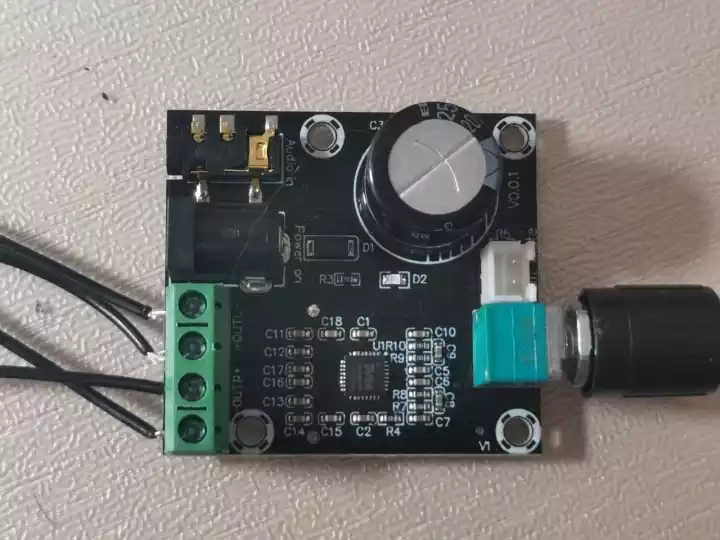
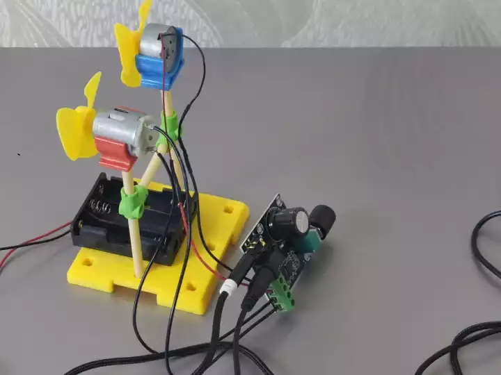
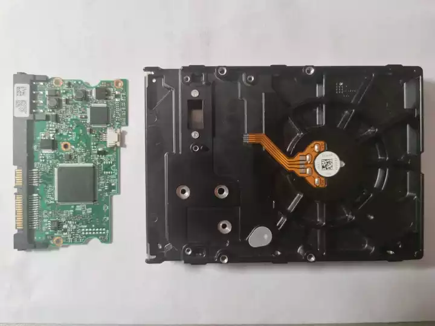
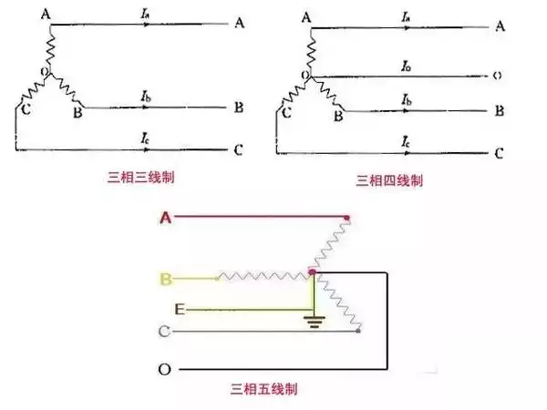
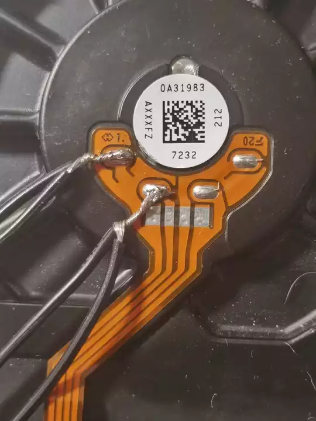
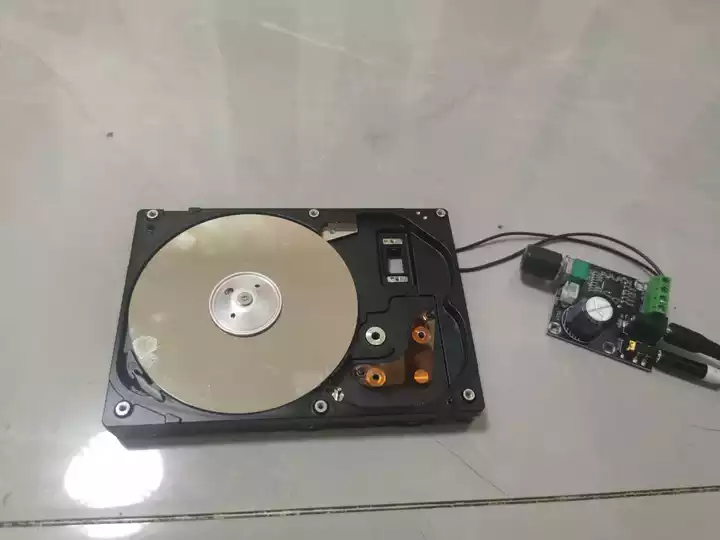

# 前言

相信你一定在视频平台上看过电机或机械硬盘改成音响的视频吧，这篇文章就来讲讲**电机发声**的原理，并教你实战完成两种 **DIY 项目**。

先来看看成果演示视频。

<iframe width="100%" height="468" src="//player.bilibili.com/player.html?isOutside=true&aid=116483103391816&bvid=BV1nL9yBbEiB&cid=37920899208&p=1" scrolling="no" border="0" frameborder="no" framespacing="0" allowfullscreen="true"></iframe>

---

# 技术原理

众所周知，直流电机不是喇叭（

但是，其结构决定了它完全可以当作振动发声单元使用。且听我细讲。

## 发声本质

- 喇叭的原理是：电信号→线圈受力→振动空气→声音。

- 电机内部也有**线圈**和**磁铁**。因此，如果给它输入音频交变信号，线圈就会不断受力、快速振动，带动整个电机外壳震动，推动空气就能发出声音。

## 功放板作用

电脑音频输出电压太小，推力不够，带不动电机振动。所以需要使用功率放大电路板，把微弱的音频信号放大功率，足够驱动电机大幅度振动，声音才够大、够清晰。

理论部分结束，开始实战！

---

# 操作方法

## 方案一：普通直流电机

### 材料准备

1. 一个或两个**直流电机**，*额定电压不超过12V*。
2. 一块**功放板**，*演示型号：PAM8610*。

3. 一根 **DC5V圆头** 接口的电源线。
4. 一根 **双向3.5mm AUX** 音频线。
5. 焊接工具（可选）

### 接线方法

观察功放板，其标识与功能的对应关系如下。

| 电路板标识 | 对应功能 |
|------|------|
| Power on | 电源 |
| Audio in | 音频输入 |
| OUTR+ | 右声道+ |
| OUTR- | 右声道- |
| OUTL+ | 左声道+ |
| OUTL- | 左声道- |

将直流电机的两个引脚分别接入其中一个声道的两个接口，接入电源线和音频线，把音频线接入到电脑或手机上。必要时可以通过焊接来固定。

设置一下音频输出设备，然后播放一首音乐。电机音响就开始工作了。

## 方案二：机械硬盘的三相直流电机

### 材料准备

1. 一块**机械硬盘**。
2. 同方案一2-5。
3. **万用表**，*用于后面测量电阻值*。

### 拆卸

用螺丝刀把硬盘的主控板拆下。可以选择拆除后盖和整个磁头。*此处演示盘片电机发声的方法。*

### 原理及分辨

盘片电机一般有3线和4线。其原理图如下：

可以发现，演示用的盘片电机是4线。由原理图可知，将公共端和其中一根相线分别连接同一声道的两个接口，即可实现与普通直流电机相同的效果。所以要先确定应当连接哪两个引脚才能正常发声。

在四线制三项直流电机中，公共端与相线的电阻值基本相等，相线之间的电阻值基本相等且大于前者。通过此方法找出公共端和一根相线，并连接导线。

### 接线方法

将公共端和其中一根相线分别连接功放板同一声道的两个接口，接入电源线和音频线，即可播放声音。

---

# 总结

整个过程无需专业知识，材料易得、操作简单，既掌握了电机发声的核心原理，又能做出专属的简易音响，既能体验动手的乐趣，也能实现闲置硬件的二次利用，是一款值得尝试的趣味DIY项目。

