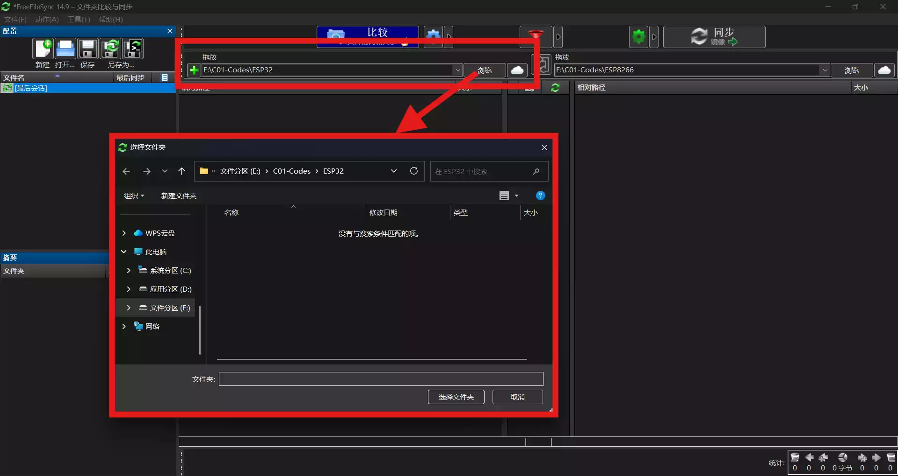
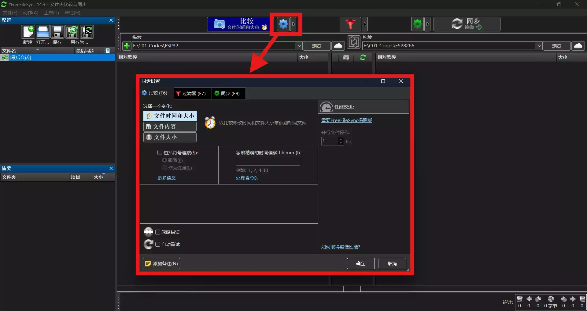
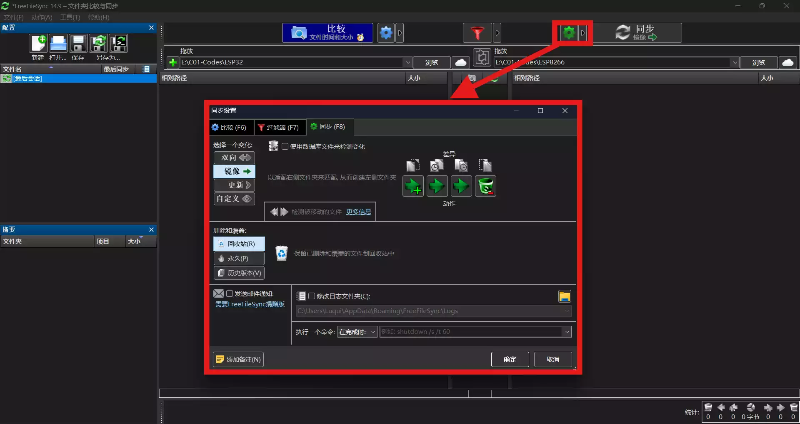

# 前言

开发项目是经常需要物理备份工程文件，以防数据意外丢失。虽然系统自带文件比对的功能，但是其逻辑不够高效，导致文件备份缓慢。

因此，在这里推荐一款**轻量、开源、高效**的**文件备份工具**，项目名称是 **FreeFileSync**，希望可以帮到大家。

演示系统：Windows 11

---

# 操作方法

## 安装

前往[ FreeFileSync 官方网站](https://example.com "标题")下载并安装软件。

  https://freefilesync.org/

## 使用方法

1. 打开软件，在上方选择对应的文件夹路径。左侧是原文件路径，右侧是备份路径。

2. 点击上方 **蓝色齿轮** 图标，设置文件比对逻辑。此处一般默认即可。

3. 点击上方 **绿色齿轮** 图标，设置备份模式。

下面对各种模式进行简单说明。
- `双向`：左右路径中的文件相互更新，使两侧文件一致。可用在多人协作中。
- `镜像`：一般的文件备份模式。左侧路径中添加、修改、删除的文件，右侧会同样处理。也就是说，备份文件夹中的文件和原文件完全一致。
- `更新`：可以理解为，只在右侧添加、修改文件，而不删除文件的`镜像`模式。
- `自定义`：此模式下，可以设置你自己需要的文件同步逻辑。

4. 先后点击 **比较** 和 **同步** 按钮，完成文件同步。

---

# 总结

无论是开发人员备份项目文件，还是普通用户同步本地与移动硬盘数据，FreeFileSync 都能通过精准的文件差异比对，减少冗余数据传输，提升备份效率，是一款值得长期收藏使用的实用工具。

