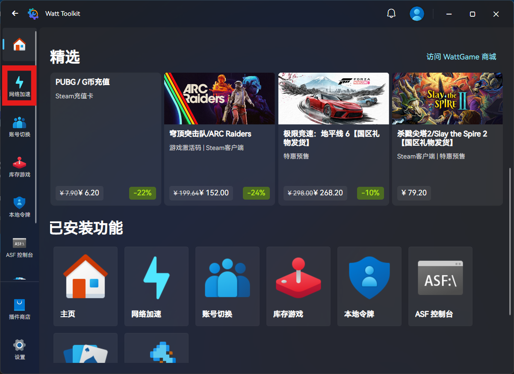
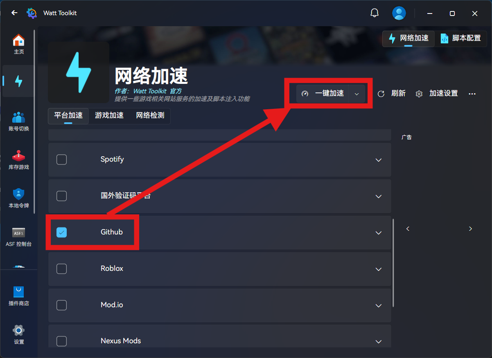
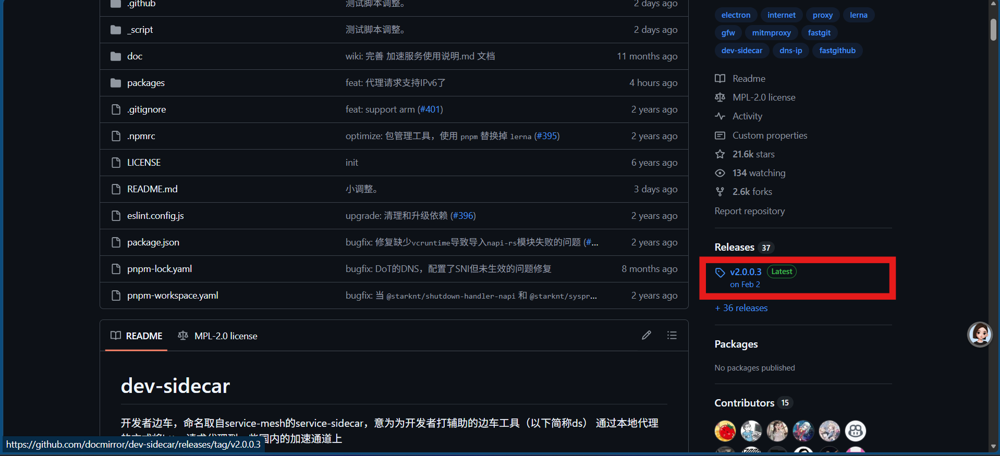
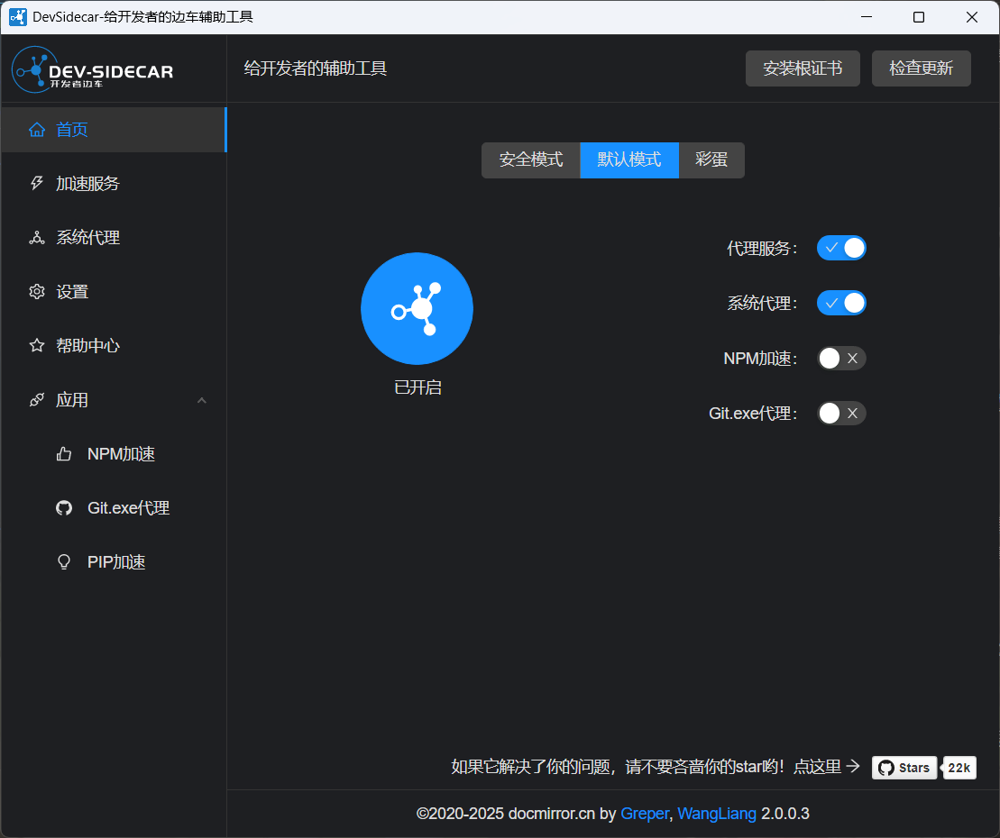
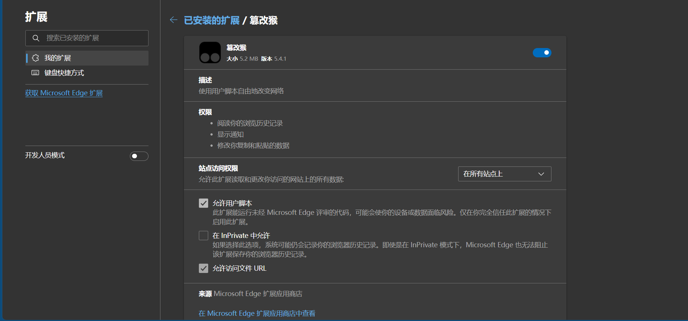
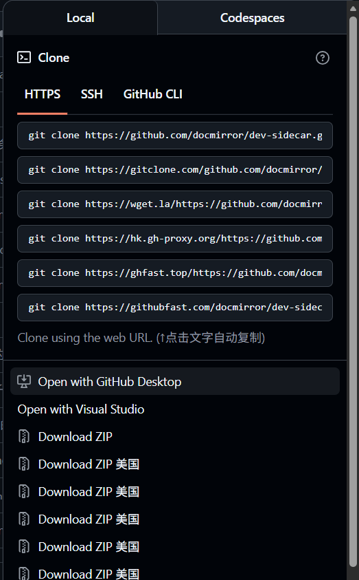

# 前言
日常写代码、逛开源仓库、拉取项目代码，离不开GitHub，但国内原生访问经常超时失败。   

此处推荐一个适合**长期自用、干净纯粹、只针对开发场景**的GitHub加速方案。此方案不属于全局代理翻墙，只优化GitHub域名网络，完全用于日常编程学习与开源交流，希望可以帮到大家。

# 操作方法

## 安装Watt Toolkit
Watt Toolkit 是一款轻量、免费的网络优化工具，最初用于 Steam 游戏加速，后续新增了GitHub加速模块。具体步骤如下：

1. 前往[Watt Toolkit 官方网站](https://steampp.net/download)下载最新版本。
:::tip[注]
有时此网址无法正常访问，可使用微软商店安装。
:::

2. 安装完成后打开软件，在左侧菜单栏找到**网络加速**选项。

3. 在加速列表中，勾选**GitHub**及相关附属加速项。

4. 点击**一键加速**，等待提示加速成功后，即可正常访问GitHub，进行后续操作。

## 安装DevSidecar
DevSidecar是专为国内开发者量身打造的开发环境加速工具，无广告、轻量且开源。官方仓库见下方链接。
::github{repo="docmirror/dev-sidecar"}

1.  在Watt Toolkit加速打开的情况下，前往仓库，在右侧release下载并安装。

:::tip[注]
Windows: 请选择DevSidecar-x.x.x-windows-universal.exe   
其他系统见仓库下方技术文档
:::

2.  安装完成后打开软件，第一次打开会提示安装证书，根据提示操作即可。

## 配置油猴插件（可选）
DevSidecar内置油猴脚本，但是更新可能不及时且不够稳定，此处以Edge浏览器为例，演示手动安装GitHub加速脚本的方法。

1. 在**扩展-获取Microsoft Edge扩展**中搜索**篡改猴**并安装。

2. 前往[GitHub高速下载脚本安装链接](https://greasyfork.org/zh-CN/scripts/412245-github-enhancement-high-speed-download)，点击**安装脚本**后会跳转安装页面，点击**安装**。

3. 现在还需要进行一些配置设置。在**管理扩展-篡改猴-详细信息**中，勾选**允许用户脚本**。

4. 在**扩展-篡改猴-管理面板-设置**中，将**通用-配置模式**修改为**高级**，将**安全-修改内容安全策略（CSP）头信息**修改为**全部移除**，点击**保存**。   
此时刷新GitHub页面，下载链接就会提供多种加速渠道了。通过`git clone 对应链接`命令即可加速下载项目代码。

# 总结
对于国内开发者而言，这些工具都是安全、合规、轻量的GitHub加速选择，能有效解决GitHub访问卡顿、加载失败、Clone缓慢等问题。非常适合需要日常使用GitHub学习、开发、协作的开发者。   

如果在使用过程中遇到加速失败、无法生效等问题，可前往两款工具的官方仓库查看解决方案，或留言交流。  
    
:::important[重要合规声明]
本文介绍的均为开发专用加速工具，不具备通用翻墙能力；
请自觉遵守《中华人民共和国网络安全法》及相关法律法规，合理使用工具，不利用工具从事任何违规、违法活动；
本文仅做技术分享与学习交流，不鼓励、不引导任何违规网络行为，若工具后续功能调整，需以官方说明为准。
:::
